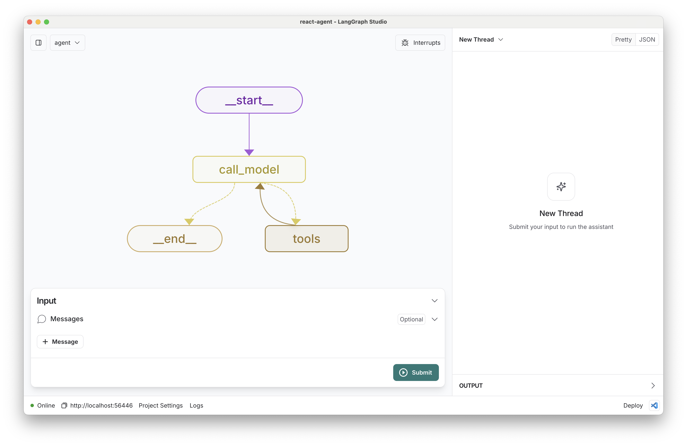

# LangGraph.js ReAct Agent テンプレート

このテンプレートは、[LangGraph.js](https://github.com/langchain-ai/langgraphjs)を使用して実装された[ReActエージェント](https://arxiv.org/abs/2210.03629)を示しており、[LangGraph Studio](https://github.com/langchain-ai/langgraph-studio)で使用するために設計されています。ReActエージェントは、シンプルでプロトタイプ的なエージェントであり、多くのツールに柔軟に拡張できます。



`src/react_agent/graph.ts`で定義されたコアロジックは、ユーザークエリについて反復的に推論し、アクションを実行する柔軟なReActエージェントを示しており、複雑な問題解決タスクにおけるこのアプローチの力を示しています。

## 何をするか

ReActエージェントは以下のように動作します：

1. ユーザーの**クエリ**を入力として受け取る
2. クエリについて推論し、アクションを決定する
3. 利用可能なツールを使用して選択したアクションを実行する
4. アクションの結果を観察する
5. 最終的な答えを提供できるまで、ステップ2-4を繰り返す

デフォルトでは、基本的なツールセットが設定されていますが、さまざまなユースケースに合わせてカスタムツールで簡単に拡張できます。

## はじめに

セットアップ手順：

1. `.env`ファイルを作成します。

```bash
cp .env.example .env
```

2. `.env`ファイルに必要なAPIキーを定義します。

主に使用される[検索ツール](./tools.ts) [^1]は[Tavily](https://tavily.com/)です。[こちら](https://app.tavily.com/sign-in)でAPIキーを作成してください。

<

<!--
Setup instruction auto-generated by `langgraph template lock`. DO NOT EDIT MANUALLY.
-->

### モデルのセットアップ

`model`のデフォルト値は以下のとおりです：

```yaml
model: anthropic/claude-3-7-sonnet-latest
```

以下の手順に従ってセットアップするか、追加のオプションから選択してください。

#### Anthropic

Anthropicのチャットモデルを使用する場合：

1. まだお持ちでない場合は、[Anthropic APIキー](https://console.anthropic.com/)にサインアップしてください。
2. APIキーを取得したら、`.env`ファイルに追加します：

```
ANTHROPIC_API_KEY=your-api-key
```

#### OpenAI

OpenAIのチャットモデルを使用する場合：

1. [OpenAI APIキー](https://platform.openai.com/signup)にサインアップしてください。
2. APIキーを取得したら、`.env`ファイルに追加します：

```
OPENAI_API_KEY=your-api-key
```

<!--
End setup instructions
-->

3. コード内でお好みのカスタマイズを行います。
4. LangGraph Studioでフォルダを開きます！

## カスタマイズ方法

1. **新しいツールを追加**: [`./tools.ts`](./tools.ts)に新しいツールを追加して、エージェントの機能を拡張します。これらは特定のタスクを実行する任意のTypeScript関数です。
2. **別のモデルを選択**: デフォルトはAnthropicのClaude 3.5 Sonnetです。設定で`provider/model-name`形式を使用して互換性のあるチャットモデルを選択し、適切な[チャットモデル統合パッケージ](https://js.langchain.com/docs/integrations/chat/)をインストールできます。例：`openai/gpt-4-turbo-preview`を選択し、`npm i @langchain/openai`を実行します。
3. **プロンプトをカスタマイズ**: [`./prompts.ts`](./prompts.ts)にデフォルトのシステムプロンプトを提供しています。Studioの設定で簡単に更新できます。

以下の方法でこのテンプレートを迅速に拡張することもできます：

- [`./graph.ts`](./graph.ts)でエージェントの推論プロセスを変更する
- ReActループを調整する、またはエージェントの意思決定プロセスに追加のステップを追加する

## 開発

グラフを反復的に開発する際は、過去の状態を編集し、過去の状態からアプリを再実行して、特定のノードをデバッグできます。ローカルの変更はホットリロードにより自動的に適用されます。エージェントがツールを呼び出す前に割り込みを追加したり、[`./configuration.ts`](./configuration.ts)のデフォルトシステムメッセージを更新してペルソナを設定したり、追加のノードやエッジを追加してみてください！

フォローアップリクエストは同じスレッドに追加されます。右上の`+`ボタンを使用して、以前の履歴をクリアした完全に新しいスレッドを作成できます。

[LangGraph](https://langchain-ai.github.io/langgraphjs/)の最新の（構築中の）ドキュメントをここで見つけることができ、例やその他の参照が含まれています。これらのガイドを使用すると、ユースケースに適したパターンを選択するのに役立ちます。

LangGraph Studioは[LangSmith](https://smith.langchain.com/)とも統合されており、より詳細なトレーシングとチームメンバーとのコラボレーションが可能です。

## 開発環境での起動

Python版の`langgraph dev`と同様に、エージェントを可視化・デバッグできます：

### 方法1: プロジェクトのWebアプリを使用（推奨）

1. **開発サーバーを起動**:
   ```bash
   npm run dev  # ルートから実行
   ```

2. **ブラウザでアクセス**:
   - `http://localhost:3000`にアクセス（Webアプリ）
   - Deployment URL: `http://localhost:2024`
   - Assistant/Graph ID: `agent`

### 方法2: LangSmith Studio（Web版）を使用

1. **開発サーバーを起動**:
   ```bash
   npm run dev  # ルートから実行
   ```

2. **LangSmith Studioにアクセス**:
   ```
   https://smith.langchain.com/studio/?baseUrl=http://127.0.0.1:2024&assistantId=agent
   ```
   - `assistantId=agent`でreact-agentを直接開きます
   - 他のグラフを開く場合は、`assistantId`を変更してください

**注意**: `http://localhost:2024`はAPIサーバーのみで、Web UIは提供していません。このプロジェクトのWebアプリ（`http://localhost:3000`）またはLangSmith Studio（Web版）を使用してください。

詳細は **[P04_LANGGRAPH_STUDIO.md](./docs/P04_LANGGRAPH_STUDIO.md)** を参照してください。

## 学習用ドキュメント

このエージェントの詳細な説明は、`docs/`フォルダ内のドキュメントを参照してください：

- **[P01_ FILE_STRUCTURE.md](./docs/P01_%20FILE_STRUCTURE.md)** - ファイル構成と各ファイルの役割
- **[P02_STATE_EXPLANATION.md](./docs/P02_STATE_EXPLANATION.md)** - 状態（State）の仕組みとPython版との対応
- **[P03_INVOCATION_FLOW.md](./docs/P03_INVOCATION_FLOW.md)** - グラフの呼び出しフロー（テストとWebアプリ）
- **[P04_LANGGRAPH_STUDIO.md](./docs/P04_LANGGRAPH_STUDIO.md)** - LangGraph Studioでの起動方法
- **[P05_TESTING.md](./docs/P05_TESTING.md)** - テストの実行方法
- **[P06_UNIT_TESTING.md](./docs/P06_UNIT_TESTING.md)** - ユニットテストの書き方（なぜ空なのか、どう書くか）
- **[P07_EMPTY_TEST_EXPLANATION.md](./docs/P07_EMPTY_TEST_EXPLANATION.md)** - 空のテストがパスする理由（Jestの動作仕様）

## テストの実行

### クイックスタート

```bash
cd apps/agents
npm install  # 初回のみ（jestとts-jestをインストール）
npm test
```

### テストの種類

- **ユニットテスト**: `npm run test:unit` - モックを使用、高速、APIキー不要
- **統合テスト**: `npm run test:integration` - 実際のLLMを使用、APIキー必要

### 特定のエージェントをテスト

- **react-agent**: `npm run test:react-agent` - react-agentのすべてのテスト
  - ユニットテストのみ: `npm run test:react-agent:unit`
  - 統合テストのみ: `npm run test:react-agent:integration`
- **memory-agent**: `npm run test:memory-agent` - memory-agentのすべてのテスト
  - ユニットテストのみ: `npm run test:memory-agent:unit`
  - 統合テストのみ: `npm run test:memory-agent:integration`

### その他のコマンド

- `npm run test:watch` - ウォッチモードで実行
- `npm run test:coverage` - カバレッジレポートを生成

詳細は **[P05_TESTING.md](./docs/P05_TESTING.md)** を参照してください。

[^1]: https://js.langchain.com/docs/concepts#tools

<!--
Configuration auto-generated by `langgraph template lock`. DO NOT EDIT MANUALLY.
{
  "config_schemas": {
    "agent": {
      "type": "object",
      "properties": {
        "model": {
          "type": "string",
          "default": "anthropic/claude-3-7-sonnet-latest",
          "description": "The name of the language model to use for the agent's main interactions. Should be in the form: provider/model-name.",
          "environment": [
            {
              "value": "anthropic/claude-1.2",
              "variables": "ANTHROPIC_API_KEY"
            },
            {
              "value": "anthropic/claude-2.0",
              "variables": "ANTHROPIC_API_KEY"
            },
            {
              "value": "anthropic/claude-2.1",
              "variables": "ANTHROPIC_API_KEY"
            },
            {
              "value": "anthropic/claude-3-7-sonnet-latest",
              "variables": "ANTHROPIC_API_KEY"
            },
            {
              "value": "anthropic/claude-3-5-haiku-latest",
              "variables": "ANTHROPIC_API_KEY"
            },
            {
              "value": "anthropic/claude-3-opus-20240229",
              "variables": "ANTHROPIC_API_KEY"
            },
            {
              "value": "anthropic/claude-3-sonnet-20240229",
              "variables": "ANTHROPIC_API_KEY"
            },
            {
              "value": "anthropic/claude-instant-1.2",
              "variables": "ANTHROPIC_API_KEY"
            },
            {
              "value": "openai/gpt-3.5-turbo",
              "variables": "OPENAI_API_KEY"
            },
            {
              "value": "openai/gpt-3.5-turbo-0125",
              "variables": "OPENAI_API_KEY"
            },
            {
              "value": "openai/gpt-3.5-turbo-0301",
              "variables": "OPENAI_API_KEY"
            },
            {
              "value": "openai/gpt-3.5-turbo-0613",
              "variables": "OPENAI_API_KEY"
            },
            {
              "value": "openai/gpt-3.5-turbo-1106",
              "variables": "OPENAI_API_KEY"
            },
            {
              "value": "openai/gpt-3.5-turbo-16k",
              "variables": "OPENAI_API_KEY"
            },
            {
              "value": "openai/gpt-3.5-turbo-16k-0613",
              "variables": "OPENAI_API_KEY"
            },
            {
              "value": "openai/gpt-4",
              "variables": "OPENAI_API_KEY"
            },
            {
              "value": "openai/gpt-4-0125-preview",
              "variables": "OPENAI_API_KEY"
            },
            {
              "value": "openai/gpt-4-0314",
              "variables": "OPENAI_API_KEY"
            },
            {
              "value": "openai/gpt-4-0613",
              "variables": "OPENAI_API_KEY"
            },
            {
              "value": "openai/gpt-4-1106-preview",
              "variables": "OPENAI_API_KEY"
            },
            {
              "value": "openai/gpt-4-32k",
              "variables": "OPENAI_API_KEY"
            },
            {
              "value": "openai/gpt-4-32k-0314",
              "variables": "OPENAI_API_KEY"
            },
            {
              "value": "openai/gpt-4-32k-0613",
              "variables": "OPENAI_API_KEY"
            },
            {
              "value": "openai/gpt-4-turbo",
              "variables": "OPENAI_API_KEY"
            },
            {
              "value": "openai/gpt-4-turbo-preview",
              "variables": "OPENAI_API_KEY"
            },
            {
              "value": "openai/gpt-4-vision-preview",
              "variables": "OPENAI_API_KEY"
            },
            {
              "value": "openai/gpt-4o",
              "variables": "OPENAI_API_KEY"
            },
            {
              "value": "openai/gpt-4o-mini",
              "variables": "OPENAI_API_KEY"
            }
          ]
        }
      },
      "environment": [
        "TAVILY_API_KEY"
      ]
    }
  }
}
-->
